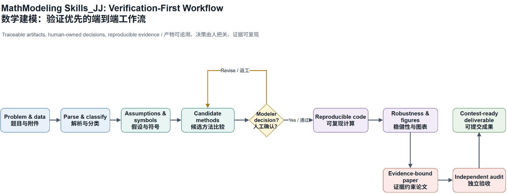
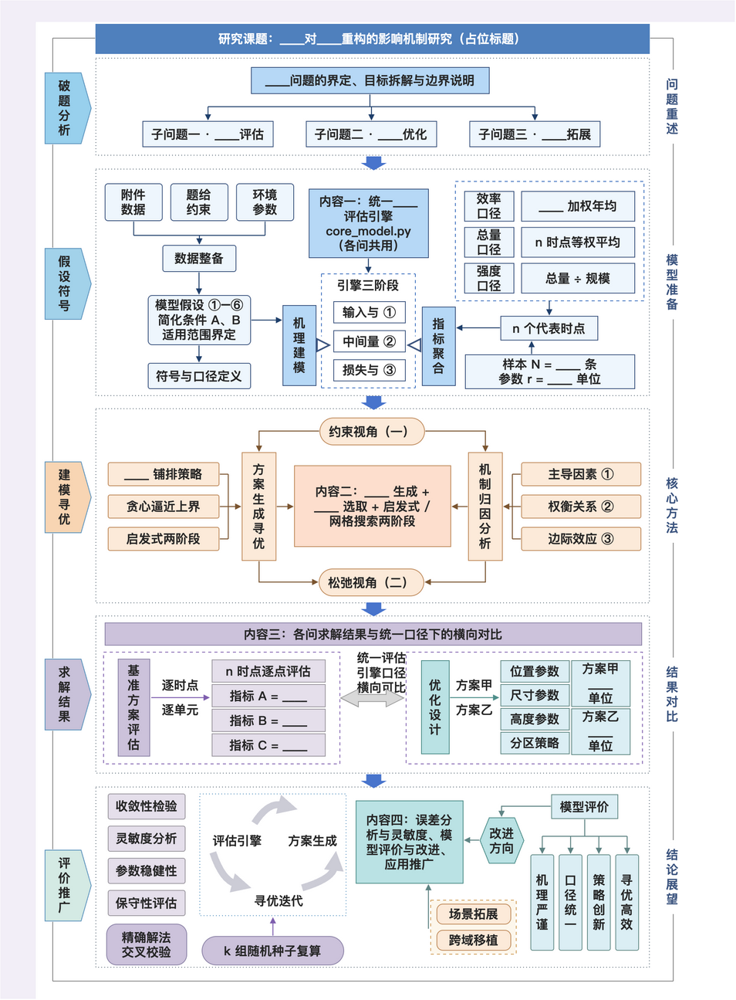
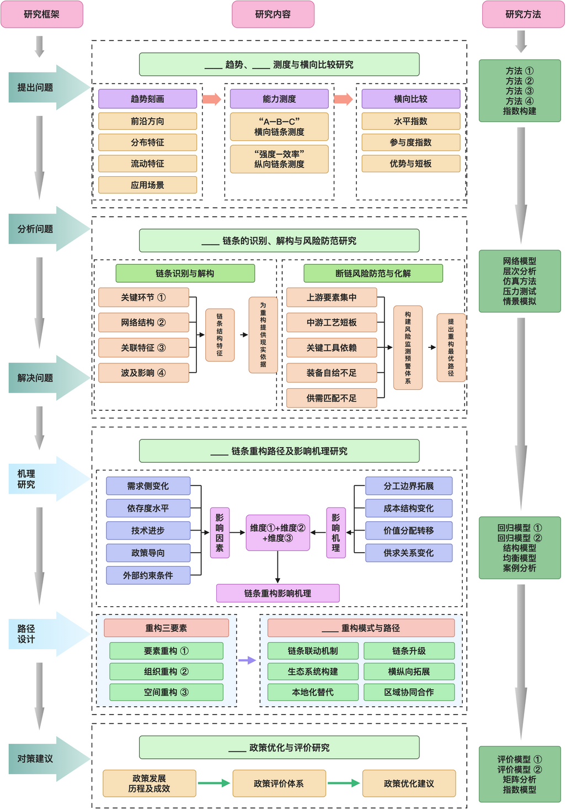
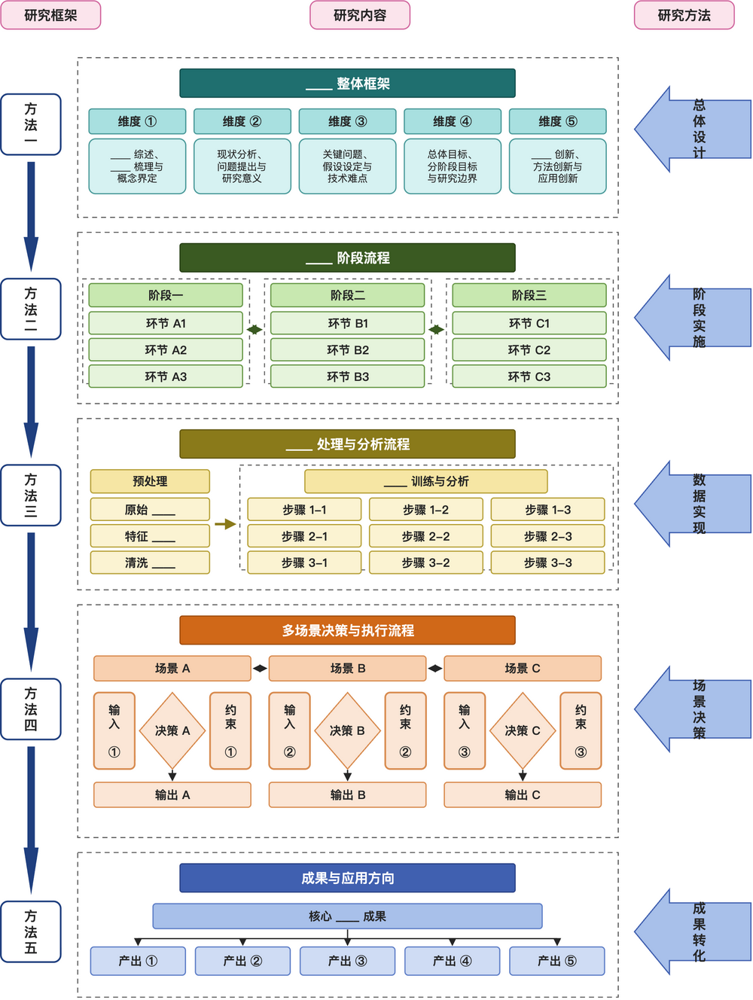
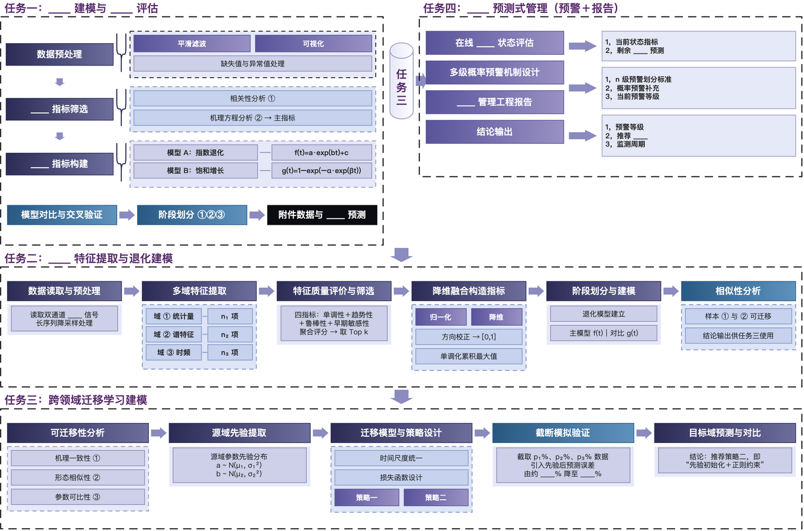

# MathModeling Skills_JJ / 数学建模技能插件

> **From raw problem statement to a defensible contest submission.**
>
> **从原始题面到可追溯、可复现、可提交的数学建模竞赛作品。**

[](https://github.com/JJ66-git/MathModeling-Skills_JJ)
[](./skills)
[](./skills/4drawio)
[](./LICENSE)

MathModeling Skills_JJ is a verification-first Codex plugin for CUMCM, MCM/ICM, Mathorcup,
Huawei Cup, and similar competitions. It connects problem analysis, human method decisions,
reproducible computation, paper-grade visual communication, evidence-bound writing, and final
audit in one workflow.

MathModeling Skills_JJ 是面向国赛、美赛、Mathorcup、华为杯及相近赛事的验证优先 Codex
插件。它把题意分析、人工方法决策、可复现计算、论文级可视化、证据约束写作与最终验收连接为一条完整工作流。

## Why star this project? / 为什么值得 Star？

Most toolkits can produce an answer. This plugin is designed to help produce a **defensible
submission**: critical transitions leave inspectable artifacts, key numerical claims are frozen
before writing, and a polished figure cannot silently become an unsupported conclusion.

许多工具可以给出“像答案”的内容。本插件更关注可辩护的参赛作品：关键阶段留下可检查产物，核心数值在写作前冻结，图表再美观也不能绕过证据与验收。

| What matters in a contest | What this plugin enforces | 竞赛中的关键问题 | 插件如何处理 |
| --- | --- | --- | --- |
| A method must be chosen for a reason | Candidate comparison, feasibility evidence, and a modeler decision record | 方法选择不能只靠“看起来合理” | 候选比较、可行性证据与建模者决策记录 |
| Results must survive a rewrite | Frozen-number artifacts and cross-media consistency audits | 改论文时数字不能漂移 | 冻结数值与跨代码、图表、论文的一致性审计 |
| Charts must explain rather than decorate | Figure contracts, source checks, font/overlap QA, and dense comparison planning | 图表要服务论证而非装饰 | 图表契约、来源核对、字号/重叠质检与信息密度规划 |
| Complex routes must remain editable | Draw.io source, MCP routing, layout inspection, and documented fallback states | 技术路线图必须可改、可审查 | Draw.io 源文件、MCP 路由、版式检查和可追溯降级状态 |
| Final delivery needs independent scrutiny | Completeness, consistency, and quality-assurance audit layers | 截稿前不能只凭感觉提交 | 完整性、一致性与质量保障三层审计 |

## The Difference at a Glance / 核心差异一图看懂

The workflow does not treat writing as the final place to invent a story. Evidence flows forward;
human judgment remains explicit where it changes the model or its conclusions.

本插件不把论文写作当作“补故事”的最后环节。证据沿流程向前传递；凡是会改变模型或结论的判断，始终显式保留给建模者。



[Open the editable Draw.io source / 打开可编辑 Draw.io 源文件](assets/readme/mathmodeling-workflow.drawio)

## Visual System / 可视化体系

### Editable diagrams, not screenshots / 可编辑图示，而非截图

The integrated `sci-box` diagram resources provide reusable Draw.io layouts for paper overviews,
research frameworks, stage flows, and landscape task pipelines. Every template is backed by
editable `.drawio` source, JSON content examples, generation scripts, preview/export utilities,
and a static layout checker.

融合的 `sci-box` 图示资源提供论文总览、研究框架、阶段流程和横版任务流水线四种可复用 Draw.io
版式。每套模板均有可编辑 `.drawio` 源、JSON 内容示例、生成脚本、预览/导出工具和静态版式检查器。

| Technical roadmap / 技术路线 | Research framework / 研究框架 |
| --- | --- |
|  |  |

| Stage flow / 阶段流程 | Task pipeline / 任务流水线 |
| --- | --- |
|  |  |

For a complex diagram, the workflow requires clear orthogonal routing, non-overlapping labels,
paper-scale legibility, and a retained editable source. Important algorithms receive a flowchart,
a mechanism diagram, both, or neither according to explanatory need, never merely to fill space.

复杂图示要求正交连线、标签不重叠、按论文插入尺寸可读，并保留可编辑源文件。重要算法会依解释需要选用流程图、机制图、两者或仅保留文字公式，不为凑图而生成冗余图示。

### Data figures that carry evidence / 承载证据的数据图

The included templates are starting points, not fabricated results. Before a figure enters a paper,
the workflow requires verified project data, a declared claim, readable final-scale typography
(Chinese sixth-size floor: 7.5 pt), and checks for clipping, overlap, uncertainty, baselines, and
meaningful extrema.

内置模板是起点而非虚构结论。图表进入论文前必须替换为真实项目数据，明确其支撑的结论，并通过最终尺寸字号（中文六号下限约 7.5 pt）、裁切、重叠、不确定性、基准线与极值标注检查。

| Prediction comparison / 预测对比 | Cross-validated ROC / 交叉验证 ROC |
| --- | --- |
|  |  |

| Correlation structure / 相关结构 | Taylor diagram / Taylor 图 |
| --- | --- |
|  |  |

Python/matplotlib/pandas is the default route. MATLAB MCP is available when the project already
depends on MATLAB or a required visualization cannot be produced reliably with the Python stack.

默认采用 Python/matplotlib/pandas；当项目已有 MATLAB 结果对象，或 Python 方案无法可靠满足所需图形能力时，可升级调用 MATLAB MCP。

## One Workflow, Inspectable Handoffs / 一条工作流，关键交接可检查

```mermaid
flowchart LR
    A[Problem + data\n题目与附件] --> B[Parse + classify\n解析与分类]
    B --> C[Assumptions + symbols\n假设与符号]
    C --> D[Candidate methods\n候选方法]
    D --> E[Modeler decision\n人工决策]
    E --> F[Python / MATLAB\n计算实现]
    F --> G[Robustness + consistency\n稳健性与一致性]
    G --> H[Figures + diagrams\n数据图与图示]
    H --> I[Evidence-bound paper\n证据约束论文]
    I --> J[Independent audit\n独立验收]
```



`workflow-orchestrator` is the canonical scheduler. It blocks code generation before a validated
method plan and blocks final assembly until the independent audit layer passes.

`workflow-orchestrator` 是统一调度入口：未经验证的方法不能直接进入代码阶段，三层独立审计未通过也不能进入最终提交。

## 48 Skills, Organized for Contest Work / 48 个技能，覆盖竞赛全链路

| Stage / 阶段 | What it covers / 覆盖能力 |
| --- | --- |
| Start | Project plan, task decomposition, contest routing, environment checks / 项目计划、任务拆解、赛事路由、环境检查 |
| Understand | Problem parsing, classification, data audit, assumptions, symbol tables / 题目解析、题型分类、数据审计、假设与符号表 |
| Decide | Candidate-method comparison, decision prompts, human decision logs, frozen numbers / 候选方法比较、决策提示、人工决策记录、关键数值冻结 |
| Compute | Python and MATLAB/Beita Tianyuan generation, review, reproducible experiments / Python 与 MATLAB/北太天元代码生成、审查和可复现实验 |
| Validate | Baselines, sensitivity, robustness, result reports, consistency audits / 基准比较、敏感性、稳健性、结果报告与一致性审计 |
| Visualize | Figure/table planning, multi-panel charts, editable Draw.io diagrams, MATLAB MCP fallback / 图表规划、多子图、可编辑 Draw.io 图示、MATLAB MCP 兜底 |
| Write | Typst/LaTeX sections, evidence-bound abstracts, references, polishing / Typst/LaTeX 论文、证据约束摘要、参考文献与润色 |
| Deliver | Completeness, quality assurance, contest-specific final verification / 完整性审计、质量保障、赛事针对性终检 |

## Designed for Paper Reality / 为真实论文写作而设计

- **CUMCM-aware writing / 国赛写作适配**: no generated table of contents; overall analysis plus evidence-based analysis for every subquestion.
- **Abstract discipline / 摘要规范**: one paragraph, 3-5 focused bold semantic groups, no whole-sentence bolding.
- **Figure discipline / 图表规范**: fewer but denser figures; merge comparable evidence, label key values and uncertainty, keep a clear source trail.
- **Algorithm diagrams by need / 算法图按需生成**: process complexity calls for a flowchart; coupling or feedback complexity calls for a mechanism diagram.
- **No invented evidence / 不虚构证据**: explicit stop conditions prevent an elegant paper from silently outrunning its results.

## Quick Start / 快速开始

Clone the repository and install all skills:

克隆仓库并安装全部技能：

```bash
git clone https://github.com/JJ66-git/MathModeling-Skills_JJ.git
npx skills add JJ66-git/MathModeling-Skills_JJ --all
```

For the full local Codex plugin, point a personal marketplace entry at the cloned directory that
contains `.codex-plugin/plugin.json`, then install `mathmodeling-skills@personal`. Start a new
Codex task after installation so its skills and MCP tools are loaded.

如需完整的本地 Codex 插件，请将个人市场条目指向包含 `.codex-plugin/plugin.json` 的克隆目录，再安装
`mathmodeling-skills@personal`。安装完成后新开一个 Codex 任务，以加载新增技能和 MCP 工具。

## Repository Layout / 仓库结构

```text
.codex-plugin/plugin.json   # Codex plugin manifest / 插件清单
skills/                     # 48 modeling, coding, visualization, writing, and audit skills
assets/readme/              # Editable workflow source and README preview / README 工作流源与预览
automcm-pro-runtime/        # Optional AutoMCM runtime helpers / 可选运行时辅助脚本
SOURCES.md                  # Provenance and integration notes / 来源与整合说明
```

## Design Principles / 设计原则

1. Evidence before prose or styling / 证据优先于文辞和装饰。
2. Human-owned assumptions and claims / 假设与核心结论由人负责。
3. Reproducible scripts and traceable artifacts / 脚本可复现，产物可追溯。
4. Explicit stop conditions instead of invented data / 明确停止条件，不虚构数据。
5. Fewer, denser, more informative figures / 更少、更密、更有信息量的图表。

## Acknowledgments / 致谢

MathModeling Skills_JJ is an integration and adaptation project. We gratefully acknowledge the
open-source projects and authors whose work informed or is included in this plugin:

MathModeling Skills_JJ 是一个整合与适配项目。感谢下列开源项目及作者为本插件提供的思路、资源或基础能力：

- [jihe520/sci-box](https://github.com/jihe520/sci-box): scientific-figure templates and the
  editable Draw.io diagram layouts, generators, and layout-checking approach used by this plugin.
  The bundled Tabler Icons attribution and MIT license are retained with the integrated resources.
- [jihe520/MathModelAgent](https://github.com/jihe520/MathModelAgent): mathematical-modeling
  workflow skills and contest-oriented references.
- [RealSeaberry/AutoMCM-Pro](https://github.com/RealSeaberry/AutoMCM-Pro): AutoMCM runtime and
  modeling-agent workflow materials.
- [Imbad0202/academic-research-skills](https://github.com/Imbad0202/academic-research-skills):
  research, paper-writing, and review foundations adapted for contest modeling.
- [jgraph/drawio-mcp](https://github.com/jgraph/drawio-mcp): editable Draw.io MCP integration.

See [SOURCES.md](./SOURCES.md) for the full provenance record and integration notes.

完整来源与整合说明见 [SOURCES.md](./SOURCES.md)。

## Contributing / 参与贡献

Issues and pull requests are welcome, especially contest-template adaptations, tested solver
patterns, visual QA improvements, and translations that preserve the evidence contracts.

欢迎提交 Issue 和 Pull Request，尤其是赛事模板适配、经验证的求解模式、图表质检改进，以及不破坏证据约束的翻译工作。

## License / 许可证

MIT. See [LICENSE](./LICENSE).
