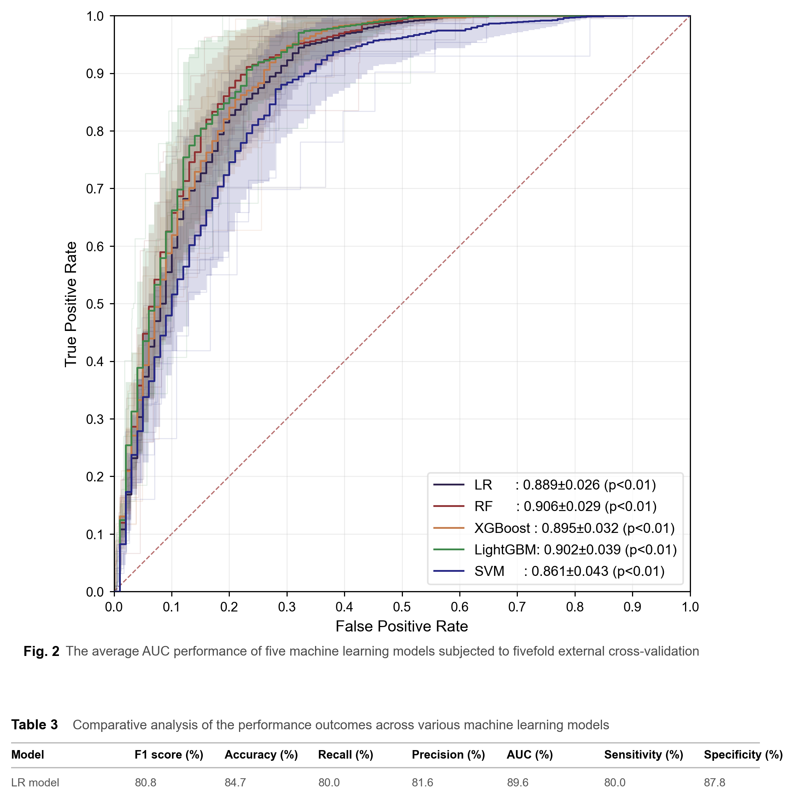
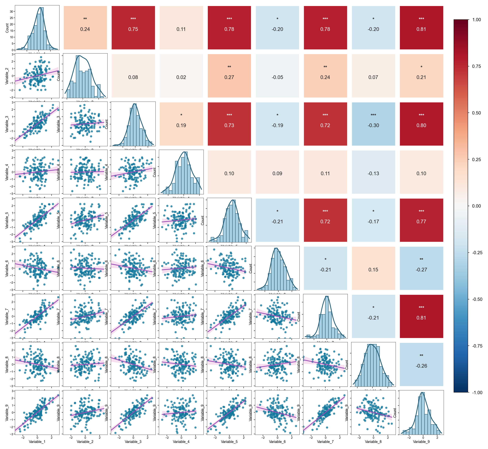
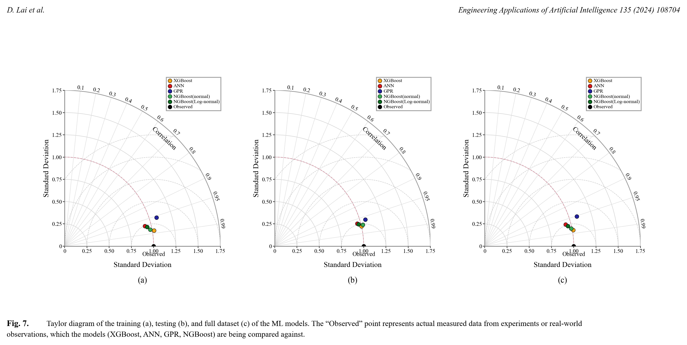
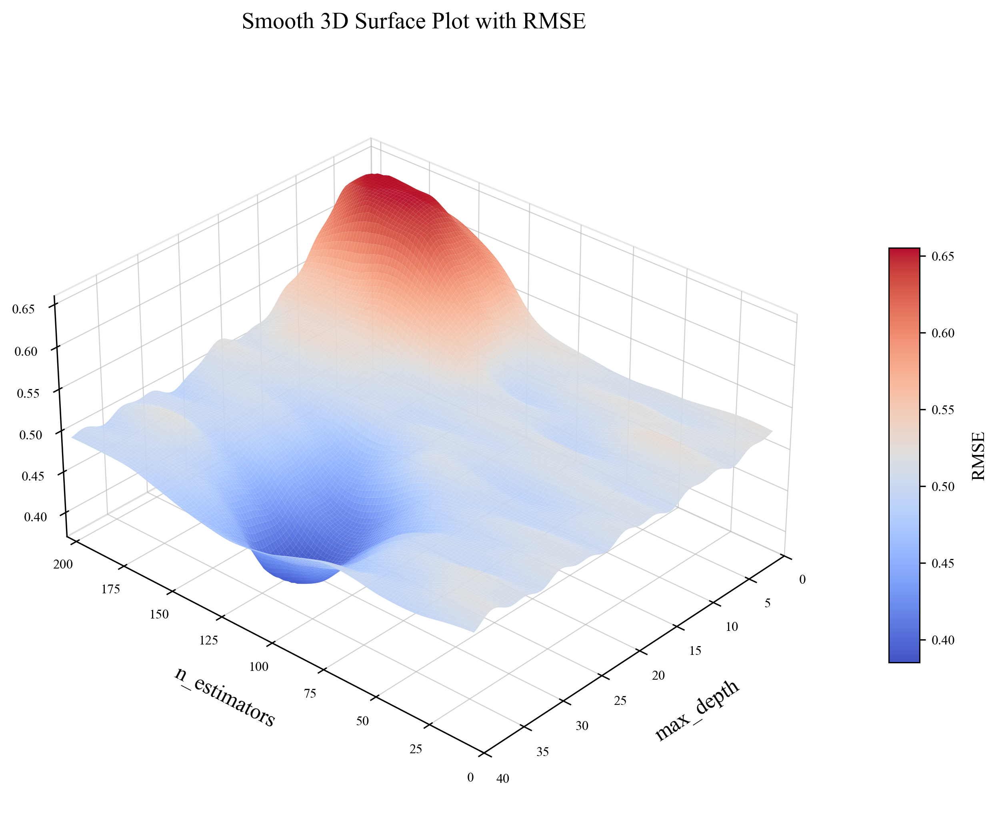

# MathModeling Skills_JJ / 数学建模技能插件

> A verification-first Codex plugin for mathematical modeling competitions: from problem parsing and method selection to reproducible computation, publication-ready figures, evidence-bound writing, and final audit.
>
> 面向数学建模竞赛的验证优先 Codex 插件：覆盖赛题解析、方法选择、可复现计算、论文级图表、证据约束写作与最终验收。

[](https://github.com/JJ66-git/MathModeling-Skills_JJ)
[](./skills)
[](./LICENSE)

## Why this plugin is different / 这个插件的优势

Most modeling toolkits can produce a plausible answer. **MathModeling Skills_JJ is designed to produce a defensible submission**: every important handoff has a concrete artifact, every major claim is tied to evidence, and the modeler keeps control of assumptions and conclusions.

许多建模工具能给出“看起来合理”的答案；**MathModeling Skills_JJ 的目标是交付可追溯、可复现、经得起检查的参赛作品**。每个关键环节都有明确产物，每项核心结论都要有证据支撑，模型假设与最终判断始终由建模者掌控。

| What you get | You can verify | 你得到的能力 | 可检查的结果 |
|---|---|---|---|
| End-to-end routing | Problem, data, model, code, paper, and audit are connected by explicit gates. | 全流程调度 | 从赛题、数据、模型、代码到论文和审计均有明确关卡。 |
| Evidence-bound writing | Frozen results, number ledgers, abstract audits, and cross-media consistency checks prevent unsupported claims. | 证据约束写作 | 冻结结果、数值台账、摘要审计和跨媒体一致性检查抑制“编数字”。 |
| Reproducible computation | Python and MATLAB/Beita Tianyuan generation and review are paired with validation, baselines, and robustness checks. | 可复现计算 | Python 与 MATLAB/北太天元生成、审查、基准和稳健性检验协同工作。 |
| Publication-grade figures | Dense figures, layout QA, editable Draw.io diagrams, and MATLAB MCP fallback are part of the workflow. | 论文级可视化 | 高信息密度数据图、排版质检、可编辑 Draw.io 流程图和 MATLAB MCP 兜底统一纳入流程。 |
| Human-owned decisions | The plugin records, rather than invents, assumptions, method choices, and contribution claims. | 人类决策优先 | 插件记录而非替代建模者的假设、方法选择和创新性判断。 |

Built for CUMCM, MCM/ICM, Mathorcup, Huawei Cup, and related workflows. It is useful both when starting from a raw problem statement and when rescuing a nearly finished paper before submission.

适用于国赛、美赛、Mathorcup、华为杯及相近赛事；既可从原始题面启动，也可在截稿前对已有方案和论文进行系统补强。

## One workflow, inspectable handoffs / 一条可追溯的工作流

```mermaid
flowchart LR
    A[Problem + data\n题目与附件] --> B[Parse + classify\n解析与分类]
    B --> C[Assumptions + symbols\n假设与符号]
    C --> D[Candidate methods\n候选方法]
    D --> E[Modeler decision\n人工决策]
    E --> F[Python / MATLAB\n计算实现]
    F --> G[Robustness + consistency\n稳健性与一致性]
    G --> H[Figures + flowcharts\n数据图与流程图]
    H --> I[Evidence-bound paper\n证据约束论文]
    I --> J[Independent audit\n独立验收]
```



`workflow-orchestrator` is the canonical scheduler. The figure path is deliberately separated from the paper path so an attractive chart cannot silently become an unsupported conclusion.

`workflow-orchestrator` 是统一调度入口。图表路径与论文路径刻意分离，避免“好看但无证据”的图直接进入结论。

## 48 skills, organized for contest work / 48 个技能，覆盖竞赛全链路

| Stage / 阶段 | English capability | 中文能力 |
|---|---|---|
| Start | Plans, task decomposition, contest routing, environment checks | 项目计划、任务拆解、赛事路由、环境检查 |
| Understand | Problem parsing, classification, data audit, assumptions, symbol tables | 题目解析、题型分类、数据审计、假设与符号表 |
| Decide | Candidate-method comparison, decision logs, frozen numbers | 候选方法比较、人工决策记录、关键数值冻结 |
| Compute | Python and MATLAB/Beita Tianyuan generation, review, and reproducible experiments | Python 与 MATLAB/北太天元代码生成、审查和可复现实验 |
| Validate | Baselines, sensitivity, robustness, result reports, consistency audits | 基准比较、敏感性、稳健性、结果报告与一致性审计 |
| Visualize | Figure/table planning, multi-panel charts, editable Draw.io flowcharts, MATLAB MCP fallback | 图表规划、多子图数据图、可编辑 Draw.io 流程图、MATLAB MCP 兜底 |
| Write | Typst/LaTeX sections, evidence-bound abstracts, references, polishing | Typst/LaTeX 论文、证据约束摘要、参考文献与润色 |
| Deliver | Completeness, quality assurance, contest-specific final verification | 完整性审计、质量保障、赛事针对性终检 |

## Real figure outputs, not decorative mockups / 真实图表示例，不是装饰性样图

The previews below are included figure-template outputs. They show dense comparison, uncertainty communication, diagnostic, and sensitivity views the visualization layer can produce from real experiment data.

下列图片均来自插件内置的图表模板预览，展示了可基于真实实验数据生成的高密度对比、不确定性表达、诊断分析和敏感性图表，而非与建模脱节的装饰图片。

| Prediction comparison / 预测对比 | Cross-validated ROC / 交叉验证 ROC |
|---|---|
|  |  |

| Correlation structure / 相关结构 | Taylor diagram / Taylor 图 |
|---|---|
|  |  |

| Parameter surface / 参数响应面 | Multi-class explanation / 多分类解释 |
|---|---|
|  |  |

The visualization rules prioritize logic before polish: comparable groups are merged instead of scattered across weak single-variable plots; extrema, baselines, uncertainty, and key values are explicitly handled; final typography remains readable at paper size. Complex technical routes can be created as editable Draw.io diagrams, with MCP verification and a documented fallback state.

可视化规范始终以逻辑正确优先：同主题信息优先合并为高密度对比，而不是拆成低效单变量图；极值、基准线、不确定性和关键数值必须显式处理；最终字号需在论文版心下清晰可读。复杂技术路线使用可编辑 Draw.io 图，并配有 MCP 验证和可追踪的降级状态。

## Papers that keep the result visible / 让论文既严谨又有重点

`writing-modeling-abstracts` creates and audits contest abstracts against frozen results. It keeps a single paragraph focused with 3-5 semantic bold groups, covering the core method, model name, metric, conclusion value, and keywords without bolding whole sentences.

`writing-modeling-abstracts` 会依据冻结结果生成并审计竞赛摘要：单段摘要保持 3-5 组语义加粗，覆盖核心方法、模型名称、量化指标、结论数值与关键词，同时避免整句加粗破坏阅读节奏。

For final delivery, the plugin also checks figure and table references, numerical consistency across code and paper, reference validity, reproducibility evidence, and contest-specific submission requirements.

在最终交付前，插件还会检查图表引用、代码与论文之间的数值一致性、参考文献真实性、可复现性证据及赛事专属提交要求。

## Quick start / 快速开始

Clone the repository and install the skill bundle:

克隆仓库后安装技能包：

```bash
git clone https://github.com/JJ66-git/MathModeling-Skills_JJ.git
npx skills add JJ66-git/MathModeling-Skills_JJ --all
```

For the complete local Codex plugin, point a personal marketplace entry at the cloned directory containing `.codex-plugin/plugin.json`, then install `mathmodeling-skills@personal`. Start a new Codex task after installation so its skills and MCP tools are loaded.

如需完整的本地 Codex 插件，请将个人市场条目指向克隆目录中的 `.codex-plugin/plugin.json`，再安装 `mathmodeling-skills@personal`。安装完成后新开一个 Codex 任务，以加载新增技能和 MCP 工具。

## Repository layout / 仓库结构

```text
.codex-plugin/plugin.json   # Codex plugin manifest / 插件清单
skills/                     # 48 modeling, coding, visualization, writing, and audit skills
automcm-pro-runtime/        # Optional AutoMCM runtime helpers / 可选运行时辅助脚本
SOURCES.md                  # Provenance and integration notes / 来源与集成说明
```

## Design principles / 设计原则

1. Evidence before prose or styling / 证据优先于文辞和装饰。
2. Human-owned assumptions and claims / 假设与核心结论由人负责。
3. Reproducible scripts and traceable artifacts / 脚本可复现，产物可追溯。
4. Explicit stop conditions instead of invented data / 明确停止条件，不虚构数据。
5. Fewer, denser, more informative figures / 更少、更密、更有信息量的图表。

## Contributing / 参与贡献

Issues and pull requests are welcome, especially contest-template adaptations, tested solver patterns, visual QA improvements, and translations that preserve the evidence contracts.

欢迎提交 Issue 和 Pull Request，尤其是赛事模板适配、经验证的求解模式、图表质检改进，以及不破坏证据约束的翻译工作。

## License / 许可证

MIT. See [LICENSE](./LICENSE).
