# MathModeling Skills_JJ

> A verification-first toolkit for mathematical modeling competitions: from problem parsing and method selection to reproducible computation, publication-ready figures, evidence-bound writing, and final audit.

[](https://github.com/JJ66-git/MathModeling-Skills_JJ)
[](./skills)
[](./LICENSE)

## Why this exists

Mathematical modeling work often fails at the handoffs: a method is not reproducible, a number drifts between code and paper, a figure is attractive but unsupported, or the abstract overclaims. **MathModeling Skills_JJ** turns those handoffs into explicit, inspectable contracts.

It is designed for CUMCM, MCM/ICM, Mathorcup, Huawei Cup, and related modeling workflows. The AI accelerates drafting and implementation; the modeler retains ownership of assumptions, claims, and final decisions.

## What you get

| Stage | Built-in capability |
|---|---|
| Start | Project plan, task decomposition, contest/workflow routing |
| Understand | Problem parsing, classification, assumptions, symbols, data audit |
| Decide | Candidate-method comparison, modeler decision log, frozen numbers |
| Compute | Python and MATLAB/Beita Tianyuan code generation and review |
| Validate | Baselines, robustness, sensitivity, result reports, consistency audits |
| Visualize | Figure/table planning, multi-panel data figures, exact flowcharts, MATLAB MCP fallback |
| Write | Typst/LaTeX paper sections, abstract formatting, references, polishing |
| Deliver | Completeness, quality assurance, contest-specific final verification |

## The workflow

```mermaid
flowchart LR
    A[Problem + attachments] --> B[Parse and classify]
    B --> C[Assumptions + symbols]
    C --> D[Candidate methods]
    D --> E[Modeler decision + frozen results]
    E --> F[Python or MATLAB computation]
    F --> G[Robustness + consistency]
    G --> H[Figures + flowcharts]
    H --> I[Evidence-bound paper]
    I --> J[Final audit]
```



The canonical scheduler is `workflow-orchestrator`. The main figure path is:

`figure-table-planner → solution-package-builder → modeling-figure-orchestrator → paper writing`

## Figure quality that survives peer review

The visualization layer keeps correctness ahead of decoration:

- four evidence families are checked: model principle, key result comparison, sensitivity/robustness, and decision scheme;
- same-theme information is merged into high-density multi-panel or grouped comparisons;
- key values, extrema, uncertainty/error bars, and baselines are present or explicitly marked `N/A` with a reason;
- single-column figures use the text width, paper-figure height is at least 5 cm, and final scaled text is at least 7.5 pt (Chinese sixth-size);
- vector output is preferred; raster figures record effective resolution at insertion size;
- exact logical flowcharts go through DrawIO, while MATLAB MCP is used only for observable Python capability gaps or MATLAB-native results.


## Abstracts that do not bury the result

`writing-modeling-abstracts` produces evidence-bound abstracts and audits them against frozen results. A single paragraph uses 3–5 semantic bold groups covering the core method, model name, quantitative metric, conclusion value, and ending keywords. Bold applies to the keyword itself, never to a whole sentence.

## Installation in Codex

For the complete local Codex plugin, clone this repository into your personal plugin source and
install it from your local marketplace. For the skill bundle alone, the standard skills installer
can read this repository directly:

```bash
git clone https://github.com/JJ66-git/MathModeling-Skills_JJ.git
npx skills add JJ66-git/MathModeling-Skills_JJ --all
```

If you already maintain a Codex personal marketplace, point its local plugin entry at the cloned
directory containing `.codex-plugin/plugin.json`, then install `mathmodeling-skills@personal`.
After installation, start a new Codex task so the new plugin version is loaded.

## Repository layout

```text
.codex-plugin/plugin.json   # Codex plugin manifest
skills/                     # 48 modeling, coding, visualization, writing, and audit skills
automcm-pro-runtime/        # Optional AutoMCM runtime helpers
SOURCES.md                  # Provenance and integration notes
```

## Design principles

1. Evidence before prose or styling.
2. Human-owned assumptions and claims.
3. Reproducible scripts and traceable artifacts.
4. Explicit stop conditions instead of invented data.
5. Fewer, denser, more informative figures.

## Contributing

Issues and pull requests are welcome. Useful contributions include contest-template adaptations, tested solver patterns, better visual QA checks, and translations that preserve the evidence contracts.

## License

MIT. See [LICENSE](./LICENSE).
