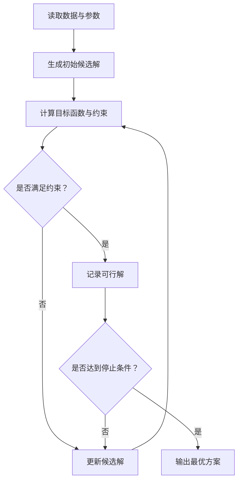

# Draw.io MCP Protocol

## Contents

1. Installed operations
2. Backend selection
3. Figure contract
4. Language and content rules
5. XML and layout rules
6. Existing-file editing
7. Verification and retry policy
8. Failure artifacts
9. Representative Chinese example

## Installed Operations

Use only these installed operations and their documented arguments:

| Operation | Arguments | Purpose |
|---|---|---|
| `mcp__drawio__open_drawio_mermaid` | `content`, optional `dark`, optional `lightbox` | Open a new standard diagram from Mermaid source. |
| `mcp__drawio__open_drawio_xml` | `content`, optional `dark`, optional `lightbox`, optional `routing` | Open a new or reconstructed diagram from Draw.io XML. |
| `mcp__drawio__search_shapes` | `query`, optional `limit` | Find a specialized stencil before building XML. |
| `mcp__drawio__list_pages` | `path` | Inspect page identities in an existing file. |
| `mcp__drawio__get_page` | `page`, `path` | Read one selected page from an existing file. |
| `mcp__drawio__set_page` | `page`, `path`, `content` | Replace only one selected page in an existing file. |

Do not invent tool names, arguments, quality modes, or whole-file mutation helpers that are not in this table. Omit optional arguments unless they serve an observed requirement.

## Backend Selection

Use Mermaid input when the contract maps cleanly to a standard flowchart, state diagram, sequence diagram, class diagram, ER diagram, or simple architecture and conversion preserves every required relationship.

Use XML input when the contract needs any of the following:

- Exact coordinates, sizes, or routing.
- Swimlanes, nested containers, layers, or parent-child geometry.
- Mixed native Draw.io shapes or specialized stencils.
- Stable ids for incremental QA.
- A dense multi-layer architecture where automatic layout changes meaning.

Use shape search only for a named specialized stencil. Prefer native basic shapes for ordinary processes, decisions, data stores, and containers.

## Figure Contract

Resolve this contract before the first call:

```yaml
figure_id: fig_q2_optimization_workflow
paper_language: zh-CN
diagram_type: swimlane-flowchart
purpose: Show the optimization and feedback procedure
nodes: []
edges: []
groups_or_lanes: []
layout_direction: top-to-bottom
target_width: 0.92-textwidth
editable_source: paper/figures/editable/fig_q2_optimization_workflow.drawio
export: paper/figures/final/fig_q2_optimization_workflow.pdf
acceptance_criteria: []
```

Every edge entry must name its source, target, direction, and visible label when required. Every decision must define all outgoing outcomes. Every feedback loop must identify its re-entry point.

## Language and Content Rules

- Derive visible language from the paper or explicit figure contract, not from the skill language.
- Chinese paper: use Chinese node labels, captions within the figure, and `是` / `否` on binary branches.
- English paper: use English node labels and `Yes` / `No` on binary branches.
- Preserve domain terms already frozen in the paper's symbol table or terminology list.
- Keep internal ids ASCII and stable. Language locking applies to visible content, not identifiers.
- Use short noun phrases for entities and verb phrases for processes. Avoid paragraphs inside nodes.

## XML and Layout Rules

Legal uncompressed Draw.io XML must contain `mxfile`, `diagram`, `mxGraphModel`, and `root`, with cells `id="0"` and `id="1"`. Use a complete file wrapper for `.drawio` and `.xml` fallback artifacts.

- Escape `&`, `<`, `>`, and quotes in attribute text.
- Give every cell a unique stable id.
- Set vertex cells to `vertex="1"` and edge cells to `edge="1"`.
- Put child cells under the correct container parent; use relative geometry only where Draw.io expects it.
- Give each edge valid `source` and `target` ids and `mxGeometry relative="1" as="geometry"`.
- Use consistent sizes for equivalent nodes and align to a simple grid.
- Use one primary reading direction. Route feedback paths around the main flow.
- Use diamonds only for genuine decisions and label every outgoing decision branch.
- Validate at the declared target width. Visible text must remain at least 7.5 pt in the final paper.
- Avoid decorative color systems. Use restrained semantic contrast and preserve grayscale legibility.

For a fallback marker, add a non-visible file attribute such as `data-status="UNVERIFIED_MCP_FALLBACK"` on `mxfile`; do not place production-status text inside the visible figure.

## Existing-File Editing

Use this exact sequence:

1. Call `mcp__drawio__list_pages(path)` and retain the returned page identities and order.
2. Resolve the target page from the request. Stop if the target is ambiguous.
3. Call `mcp__drawio__get_page(page, path)` for the target.
4. Parse and modify only the returned page content. Preserve unrelated ids, styles, and geometry.
5. Call `mcp__drawio__set_page(page, path, content)` with the same target identity.
6. Repeat list/get checks. Compare the target change against the requested delta and verify untargeted page identities and order are unchanged.

Do not reconstruct the entire file, concatenate XML strings across pages, or overwrite an original file after a failed read.

## Verification and Retry Policy

After every render attempt, record:

- Structural parse result and unique-id result.
- Required node/edge/lane/layer coverage.
- Language and binary-branch compliance.
- Existing-page preservation when applicable.
- Target-width inspection: text size, clipping, overlap, connector ambiguity, margins, and export bounds.
- Editable-source existence and export existence.

Allow no more than three render attempts total: initial render plus up to two repairs. A retry must respond to a named observed defect. After attempt three, create fallback artifacts and a blocking issue instead of claiming completion.

Use these promotion conditions together:

```text
editable_source_exists
AND export_exists
AND structural_QA == PASS
AND visual_QA == PASS
AND language_QA == PASS
AND required_issue_status NOT IN {OPEN, BLOCKING}
```

## Failure Artifacts

Use this layout:

```text
paper/
  figures/
    placeholders/
      <figure_id>.mmd | <figure_id>.tex
      <figure_id>.pdf | <figure_id>.png
    editable/
      <figure_id>.drawio
      <figure_id>.xml
  issues/
    issue_register.md
    drawio-mcp/
      <figure_id>/
        issue.md
        call-log.txt          # when available
        validation-log.txt    # when available
```

Minimum `issue.md` fields:

```yaml
figure_id: <figure_id>
status: OPEN
severity: BLOCKING
artifact_state: UNVERIFIED_MCP_FALLBACK
paper_location: <section and figure slot>
failure_reason: <observed failure>
attempts: <1..3>
fallback_drawio: <path>
fallback_xml: <path>
placeholder_source: <path>
placeholder_render: <path>
recovery_action: <specific next action through using-drawio-mcp>
```

The shared register contains one row per issue with figure id, status, severity, owner skill, issue folder, paper location, and next action. It is an internal production artifact and must not be cited in the paper.

Choose Mermaid for a standard placeholder that it can represent faithfully. Choose TikZ when mathematical notation, precise geometry, or TeX-native typography is essential. In both cases render an image so the writer can maintain layout. Mark the manifest state `PLACEHOLDER` and keep G5/G6 blocked.

## Representative Chinese Example

Contract excerpt:

```yaml
figure_id: fig_q2_optimization_loop
paper_language: zh-CN
diagram_type: flowchart
required_decision: "是否满足约束？"
yes_branch: "是"
no_branch: "否"
feedback_target: "更新候选解"
```

If the MCP service is unavailable, create a Chinese Mermaid placeholder such as:



Also create legal `.drawio` and `.xml` fallbacks with `data-status="UNVERIFIED_MCP_FALLBACK"`, register the failure under `paper/issues/drawio-mcp/fig_q2_optimization_loop/`, and block G5/G6. The equivalent English figure must replace all visible labels with English and use `Yes` / `No`; do not mix the two languages.
